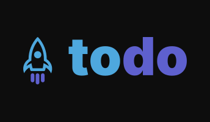

<h1 align="center">
  
</h1>

<p align="center">
  <a href="#features">Features</a>&nbsp;&nbsp;&nbsp;|&nbsp;&nbsp;&nbsp;
  <a href="#technologies">Technologies</a>&nbsp;&nbsp;&nbsp;|&nbsp;&nbsp;&nbsp;
  <a href="#getting-started">Getting started</a>&nbsp;&nbsp;&nbsp;|&nbsp;&nbsp;&nbsp;
  <a href="#project">Project</a>&nbsp;&nbsp;&nbsp;|&nbsp;&nbsp;&nbsp;
</p>

<br>

<p align="center">
  
</p>

---

## Features

- [x] Adds a new task
- [x] Marks and unmarks a task as completed
- [x] Removes a task from the list
- [x] Show task completion progress

## Technologies

This project was developed using the following technologies:

- [React Native](https://reactnative.dev/)
- [Expo bare workflow](https://expo.io/)
- [TypeScript](https://www.typescriptlang.org/)

## Getting started

Clone the project and access the folder

```bash
$ git clone https://github.com/HelvioFilho/todolist && cd todolist
```

Follow the steps below
```bash
# Install the dependencies
$ npm install

# Start the project
# Android
$ expo run:android 

# IOS
$ expo run:ios
```

## Project

The app is a to-do list, being able to control your day-to-day tasks.
The construction of the app was proposed by a challenge from Rocketseat's ignite course.